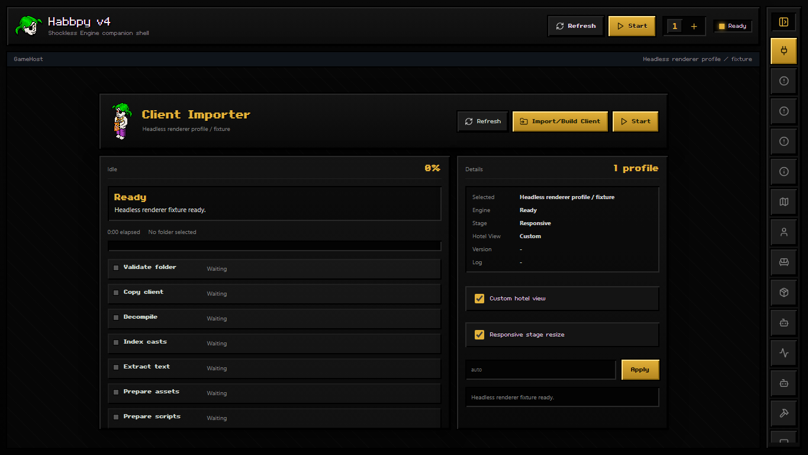
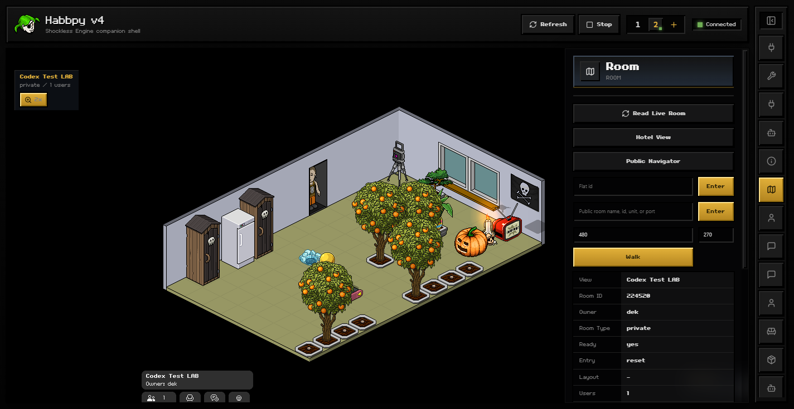

Habbpy v4
=========

Habbpy v4 is a local desktop companion shell for the Shockless engine. It packages a playable Windows app, the Habbpy v4 application source, and the Shockless engine source needed to rebuild, audit, or modify the project under the GNU Affero General Public License v3.0.

What It Is
----------

Habbpy v4 wraps a modern Shockwave-compatible runtime in an Electron desktop shell. The app can import a user-supplied compiled client into a playable Shockless profile, embed that profile in the GameHost, expose live session and packet state, and run first-party or user-installed plugins through a restricted plugin API.

How It Works
------------

- The Electron main process manages app lifecycle, client profile import, portable packaging, and visible or hidden runtime sessions.
- The React renderer provides the GameHost, right-side plugin dock, backtick console, packet log, client importer, plugin manager, and module panels.
- Shockless runs the imported client in a browser runtime and exposes controlled engine/session hooks back to Habbpy v4.
- The relay and packet-log layers parse live client/server traffic into readable packet rows for panels, console output, and plugin events.
- User plugins run in a restricted Worker host. Plugins request named permissions and call grouped APIs for rooms, users, furni, chat, packets, sessions, storage, timers, and UI panels.

Languages And Stack
-------------------

- TypeScript and JavaScript
- React
- Electron
- Vite
- Node.js
- Playwright-based automation and screenshot checks
- Shockless engine runtime with browser-rendered Director/Shockwave compatibility layers

Screenshots
-----------

Main app UI with the plugin dock closed

Embedded Shockless room view

Credits
-------

Habbpy v4's client import/build flow uses `ProjectorRays <https://github.com/ProjectorRays/ProjectorRays>`_ for Shockwave/Director decompilation during profile preparation. ProjectorRays is an independent open-source decompiler for Macromedia/Adobe Director and Shockwave projects.

License
-------

This public release is provided under the GNU Affero General Public License v3.0. See LICENSE in this folder.

Release Layout
--------------

- portable/HabbpyV4/Habbpy v4.exe
  Runnable Windows portable build.

- src/habbpy-v4-shockless
  Electron/React application source, plugin manager, packet log, multi-session shell, relay bridge, and plugin API.

- src/habbo-origins-engine
  Shockless engine source and standalone importer source used by Habbpy v4.

- docs
  Public HTML documentation with clean file names.

Key Features
------------

- Portable Windows desktop build.
- Client import/build flow for user-supplied compiled client folders or existing Shockless profiles.
- Embedded game view with responsive stage sizing, zoom controls, session switcher, and collapsible plugin dock.
- Plugin manager for bundled plugins and user-installed plugins.
- Plugin template and public HTML API documentation for writing custom plugins.
- Backtick console for session commands and readable packet/session output.
- Packet log panel with client/server/relay filters and per-session filtering.
- Multi-session control surface for visible and hidden sessions.
- Runtime panels for connection/session state, room state, users, inventory, items, chat, social state, packet inspection, and developer diagnostics.

How To Import A Client
----------------------

1. Run ``portable/HabbpyV4/Habbpy v4.exe``.
2. Open the Connection panel and choose ``Import/Build Client``.
3. Select either a compiled Habbo client folder or an existing Shockless profile folder.
4. Leave the importer open while it validates the folder, copies the client, indexes casts, extracts text, prepares assets, prepares scripts, and validates the playable profile.
5. When the profile is ready, select it in the client library and press ``Start``.

Imported playable profiles are stored beside the portable app in its local client profile folder and are reused on later launches. Habbpy v4 does not hardcode client build folders; the importer discovers the selected folder and builds or reuses the matching playable profile.

Requirements For Rebuilding
---------------------------

- Node.js 20 or newer
- npm
- Windows for the portable packaging flow

Build From Source
-----------------

Open PowerShell in this release folder.

Build the engine::

   cd src/habbo-origins-engine
   npm install
   npm run build
   cd standalone
   npm install
   npm run build

Build the desktop app::

   cd ../../habbpy-v4-shockless
   npm install
   npm run build

Build a portable app::

   npm run package:portable

The app packaging script expects src/habbo-origins-engine to sit beside src/habbpy-v4-shockless, which is already how this release is laid out.

Limitations
-----------

- The packaged portable flow targets Windows.
- A playable client is not bundled. Users must import their own compatible compiled client folder or existing Shockless profile.
- Live online features require a working network connection and user-owned credentials entered locally at runtime.
- Client/server compatibility depends on the imported client build and the target service version.
- User plugins are intentionally sandboxed. APIs that touch packets, session control, or engine actions require explicit plugin permissions and validated payloads.
- Director/Shockwave compatibility is still evolving; plugin authors should test against the client build they plan to use.
